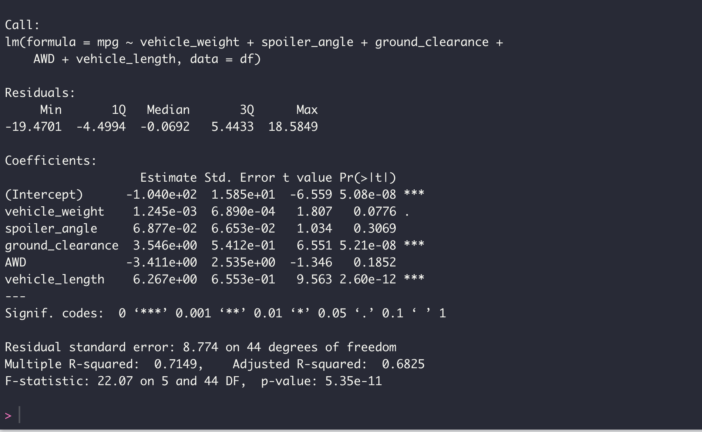
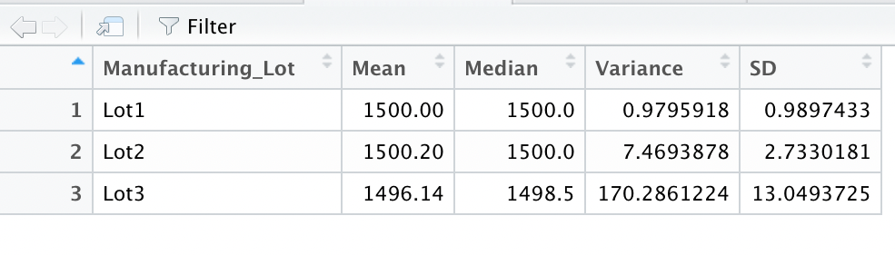
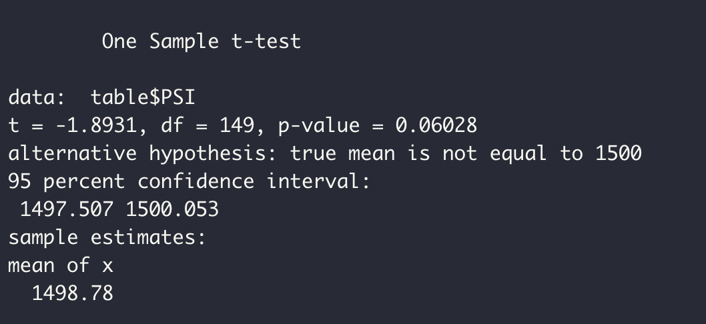
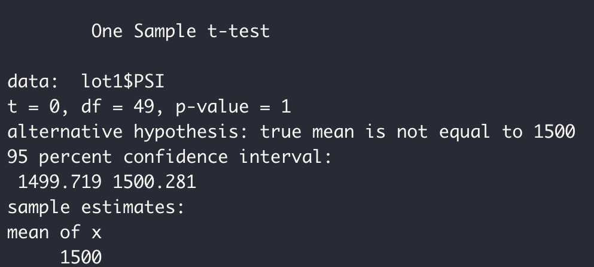
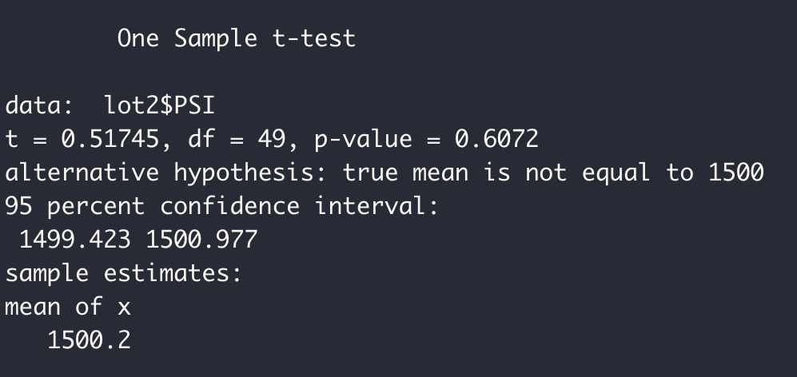
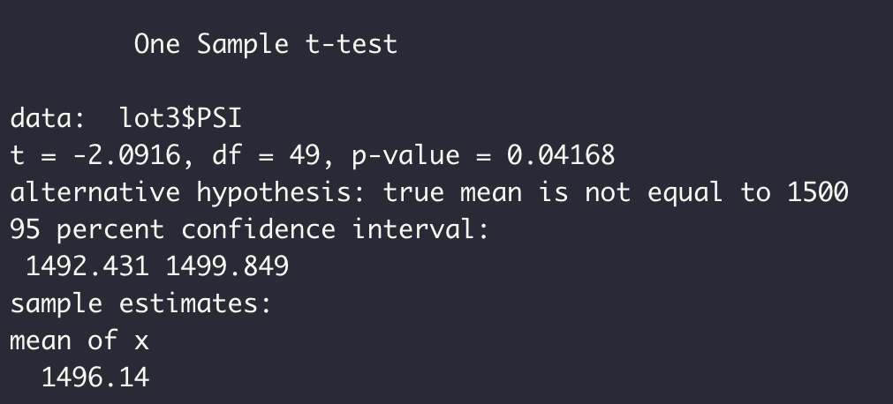

# MechaCar_Statistical_Analysis
This repo uses R to peform statistical calculations/data analysis on MechaCar data and review the production data for insights that may help the manufacturing team.

## Linear Regression to Predict MPG
 
The Linear Resgression shows the variables/coefficients that provides a non-random amount of variance to the MPG values are Ground_clearance and Vehicle_length. The slope of the linear model is not zero because the linear regression shows that some of the independent variables had a significant effect on the dependent variable. This linear model can predict the MPG of MechaCar Prototypes effectively as the R-squared value is 0.7149 with roughly 70% accuracy.

## Summary Statistics on Suspension Coils
 
 
The total_summary shows us that the variance of the suspension coils does not exceed 100 PSI. But upon closer inspection when grouping the summary data with their own individual Manufacturing lot, the data tells us while the first two manufacturing lot meet the design specification and does not exceed the suspension coil variance with under 100 PSI the thrid lot exceeds the variance with 170.3 PSI. 

## T-Tests on Suspension Coils

t-tests to determine if all manufacturing lots and each lot individually are statistically different from the population mean of 1,500 pounds per square inch.

- ### lot 1
  Assuming our significance level was the common 0.05 percent, our p-value is above our significance level. Therefore, we do not have sufficient evidence to reject the null hypothesis, and we would state that the two means are statistically similar.
  
   

- ### lot 2
  Assuming our significance level was the common 0.05 percent, our p-value is above our significance level. Therefore, we do not have sufficient evidence to reject the null hypothesis, and we would state that the two means are statistically similar.
  
   

- ### lot 3
  Assuming our significance level was the common 0.05 percent, our p-value is below our significance level. Therefore, we have sufficient evidence to reject the null hypothesis, and we would state that the two means are statistically different.
  
   
  
  
## Study Design: MechaCar vs Competition
To design a statistical study to compare performance of the MechaCar vehicles against performance of vehicles from other manufacturers the steps i would take are as follows:
- Test to determine city and highway fuel efficiencies.
- H0 = cars belonging to same class have similar fule efficiency.
- Ha = cars in same class have different fule efficiency.
- A two-Sample t-test or ANOVA test to test the hypothesis.
- This would require a large dataset of 50 individual cars to run the statistical test.

